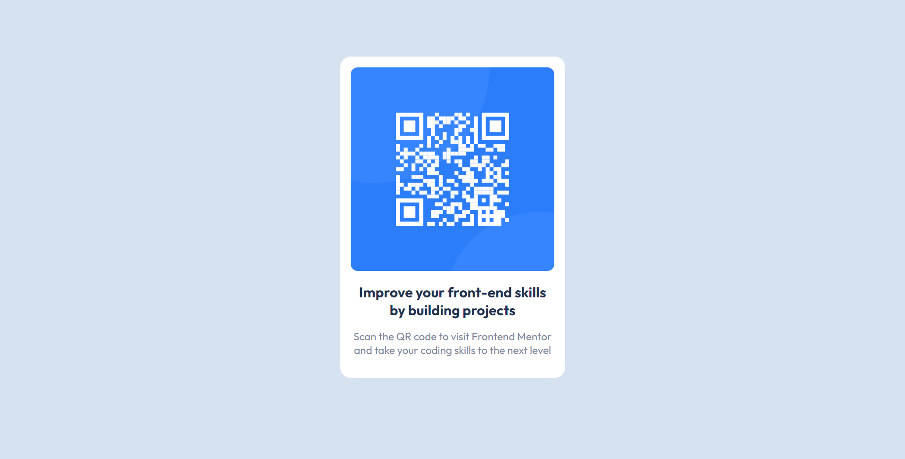

# Frontend Mentor - QR code component solution

This is a solution to the [QR code component challenge on Frontend Mentor](https://www.frontendmentor.io/challenges/qr-code-component-iux_sIO_H). Frontend Mentor challenges help you improve your coding skills by building realistic projects.

---
## Table of contents

- [Overview](#🌞-overview)
  - [Screenshot](#📸-screenshot)
  - [Links](#🔗-links)
- [My process](#🤔-my-process)
  - [Built with](#🏗️-built-with)
  - [What I learned](#🧠-what-i-learned)
  - [Useful resources](#👩‍💻-useful-resources)
- [Author](#😸-author)

---

## 🌞 Overview

### :camera_flash: Screenshot



### 🔗 Links

- Solution URL: [GitHub Repository](https://github.com/Padilha04/qrcode-challenge)
- Live Site URL: [GitHub Page](https://padilha04.github.io/qrcode-challenge/)

---

## 🤔 My process

### 🏗️ Built with

- Semantic HTML5 markup
- CSS custom properties
- Media Query

### 🧠 What I learned

Basically learned how to apply media query function to my website to be responsible.

This it what I'm proud of learning in this challenge:

```css
@media screen and (max-width:600px) {
    .container {
        width: 288px;
        margin: 100px auto;}}
```

### 👩‍💻 Useful resources

- [5 Reasons Why Your CSS Media Queries Are NOT Working](https://www.youtube.com/watch?v=acqN6atXVAE) - This video helped me because I was stuck trying to make @media function to work. Solution was in the position of meta tag on the bottom of the list on the head html. 

---

## 😸 Author

### Amanda Padilha
- Portfolio - [Amanda Padilha](https://amandapadi.notion.site/Amanda-Padilha-Portf-lio-f5cc302c77014bea8a538ab908342784)
- Github - [Padilha04](https://github.com/Padilha04)
- LinkedIn - [Amanda Padilha](www.linkedin.com/in/amanda-padilha)
- Frontend Mentor - [@Padilha04](https://www.frontendmentor.io/profile/yourusername)


